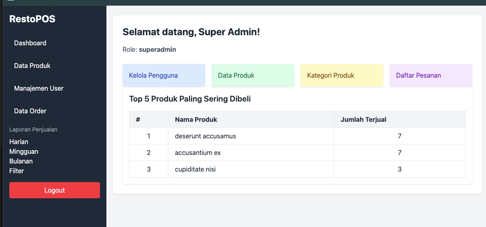
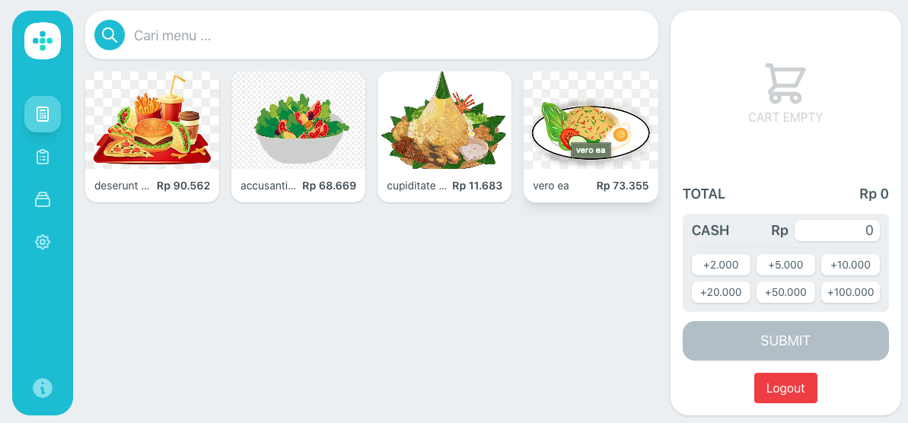

# 🍽️ RestoPOS - Point of Sale System

A web-based **Point of Sale (POS)** system for restaurants with features to manage:
- Products
- Product Categories
- Sales Transactions
- Sales Reports
- User Management (Superadmin, Cashier, Manager)

## 🚀 Key Features
- **Product Management**: CRUD operations for Products with images, categories, and active status
- **User Management**: Role-based Access Control (Superadmin, Cashier, Manager)
- **Order Management**: Multi-product sales transactions
- **Sales Reports**: Daily, Weekly, Monthly with date filtering
- **Authentication & Authorization**: Laravel Auth with Role Protection
- **Role-Based Dashboard**: Custom dashboard for each user role
- **Responsive UI**: Built with TailwindCSS
- **SweetAlert 2**: Delete confirmation dialogs
- **Database Seeders**: Initial data for Users, Products, Categories, Orders

## 🛠️ Technology Stack
- **Backend**: Laravel 10+
- **Frontend**: Blade, TailwindCSS
- **Database**: MySQL/MariaDB
- **Authentication**: Laravel Breeze (optional)
- **JS Library**: SweetAlert2

## 📦 Installation & Setup

### 1. Clone Repository
```bash
git clone https://github.com/rizkilabs/restaurant-pos.git
cd restaurant-pos
```

### 2. Install Dependencies
```bash
composer install
npm install
npm run build
```

### 3. Configure Environment
Create `.env` file:
```bash
cp .env.example .env
```
Configure database connection in `.env`:
```
DB_DATABASE=restopos
DB_USERNAME=root
DB_PASSWORD=
```

### 4. Generate App Key
```bash
php artisan key:generate
```

### 5. Run Migrations & Seeders
```bash
php artisan migrate --seed
```
This will:
- Create all database tables
- Seed initial data for Users, Products, Categories, Orders

### 6. Start Development Server
```bash
php artisan serve
```
Access the app at: [http://localhost:8000](http://localhost:8000)

## 👥 Default User Accounts

| Role        | Email                   | Password  |
|-------------|--------------------------|-----------|
| Superadmin  | superadmin@example.com   | password  |
| Cashier     | cashier@example.com      | password  |
| Manager     | manager@example.com      | password  |

## 🗂️ Project Structure

```
app/
  Models/
    Product.php
    ProductCategory.php
    Order.php
    OrderDetail.php
    User.php
database/
  seeders/
    UserSeeder.php
    ProductCategorySeeder.php
    ProductSeeder.php
    OrderSeeder.php
    OrderDetailSeeder.php
resources/
  views/
    products/
    categories/
    orders/
    users/
    layouts/
      app.blade.php
    partials/
      sidebar.blade.php
routes/
  web.php
```

## 🔒 Roles & Permissions

| Role        | Access Level |
|-------------|--------------|
| Superadmin  | Full access (Products, Orders, Users, Reports) |
| Cashier     | Process sales transactions |
| Manager     | View sales reports and product dashboard |

## 🎯 Future Improvements
- PDF report export
- Sales charts (Chart.js)
- Refund/Void transaction feature
- Multi-cashier shift management
- Restaurant settings (Name, Logo, etc.)

## 📸 Screenshots




## 🤝 Contributing
Pull requests are welcome! For major changes, please open an issue first to discuss what you'd like to change.

## ⚖️ License
[MIT](https://choosealicense.com/licenses/mit/)

## 📢 Important Notes
- Ensure `/storage` and `/bootstrap/cache` directories are writable (`chmod -R 775`)
- For product image upload issues, check PHP configuration (`upload_max_filesize`, `post_max_size`)

## 🚀 Enjoy using RestoPOS!
